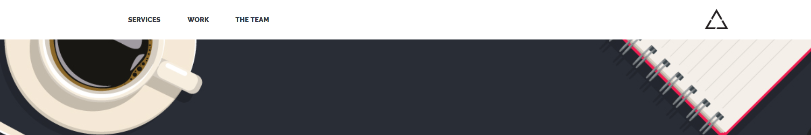

# AppLove

* **Track:** _Common Core_
* **Curso:** _Creando tu primer sitio web interactivo_
* **Unidad:** _Maquetado web con HTML & CSS_

***

Práctica.

## Se utilizó

`HTML`   `CSS` `repositorio AppLove`

## Muestra del trabajo y descripción

En este trabajo de aplica lo aprendido sobre **Box-model**, **positioning**, **tipografias**, **iconos** entres otras propiedades,

para recrear una página de AppLove más las herramientas y facilidades ya dadas en el repositorio AppLove.

- El `header` es **estático**.

-El trabajo tienes 4 secciones.

- El tipo de fuente utilizada es `Raleway`.

`Nota:`

*Este trabajo se ha subido a gh-pages [aquí](https://yaniraab.github.io/app-love-ready/).
